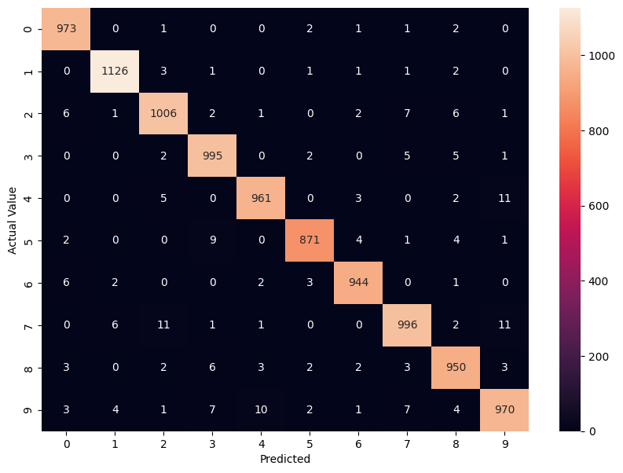

# Hand Written Digit Recognition

### Decision Tree
```text
Accuracy: 88.0%
```


### Random Forest
```text
Accuracy: 96.86%
```


### K-Nearest Neighbors (kNN)
```text
Accuracy: 96.88%
```


### Support Vector Machine (SVM)
```text
Accuracy: 97.92%
```

